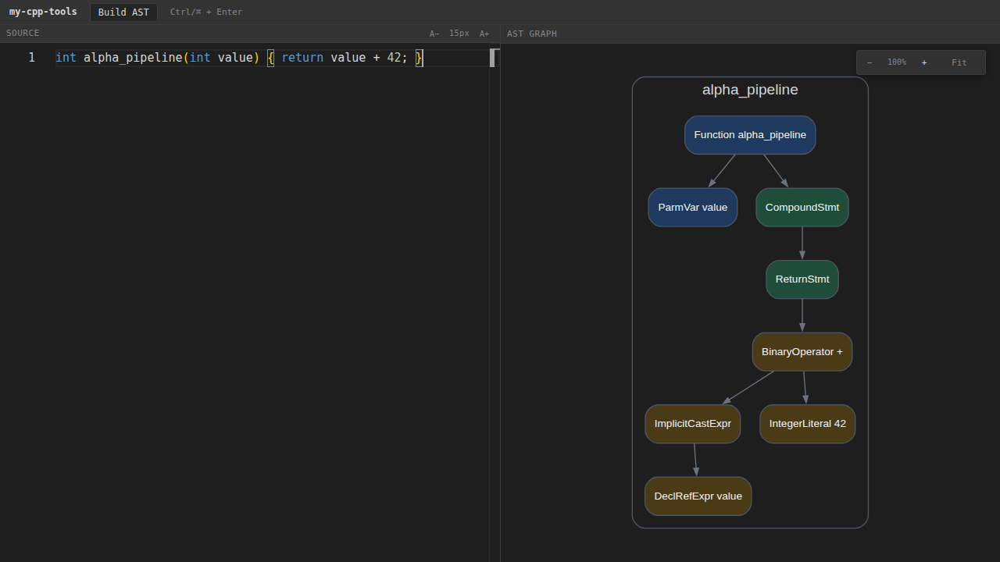

# my-cpp-tools

[](https://github.com/litvinovmitch11/my-cpp-tools/actions/workflows/ci.yml)
[](https://github.com/litvinovmitch11/my-cpp-tools/actions/workflows/security.yml)
[](LICENSE)

`my-cpp-tools` turns C++ source code into interactive program-analysis graphs.
The alpha release provides a complete AST pipeline: edit C++ in the browser,
send it to a local Go API, analyze it with Clang, and inspect the result as an
interactive graph.

> [!WARNING]
> The alpha backend is local-only and must not be exposed to untrusted
> networks. Clang runs as a native process and is not isolated by a container
> or OS sandbox.



## Architecture

```text
React editor
    │ POST /api/v1/ast
    ▼
Go HTTP API ── bounded native-process runner
    │ temporary input.cpp
    ▼
Clang AstPrinter
    │ DOT
    ▼
Graphviz Web Worker ── sanitized SVG ── interactive graph view
```

The monorepo has three components:

- `cpp/` contains the Clang-based `AstPrinter` and future project-owned graph
  analysis tools.
- `backend/` contains the Go API, validation, process limits, and error mapping.
- `web/` contains the React/TypeScript editor and Graphviz visualization.

CFG and CDG are deliberately outside the alpha scope. They will be implemented
manually: CFG from Clang AST data and CDG from the project-owned CFG. The project
will not use `clang::CFG`, LLVM analysis passes, or third-party CFG/CDG builders.

## Prerequisites

- CMake 3.28 or newer;
- a matching LLVM and Clang toolchain with development packages;
- Go 1.27 or newer;
- Node.js 24 or newer;
- `make` and `rg` (ripgrep).

On Ubuntu, LLVM/Clang packages commonly include `clang`, `clang-format`,
`clang-tidy`, `llvm-dev`, and `libclang-dev`.

## Start from a fresh clone

```bash
git clone https://github.com/litvinovmitch11/my-cpp-tools.git
cd my-cpp-tools
make bootstrap
make dev
```

Open `http://127.0.0.1:5173`. `make dev` builds `AstPrinter`, starts the Go API
on `127.0.0.1:8080`, starts Vite, and stops both processes together. Use
<kbd>Ctrl</kbd>/<kbd>⌘</kbd> + <kbd>Enter</kbd> to build a graph.

Configuration is environment-based. See [`.env.example`](.env.example) for all
supported local settings; it contains no secrets.

## API

`POST /api/v1/ast` accepts one JSON object:

```json
{
  "code": "int main() { return 42; }"
}
```

A successful response contains DOT:

```json
{
  "dot": "digraph AST { ... }"
}
```

Errors use a stable envelope and may include sanitized compiler diagnostics:

```json
{
  "error": {
    "code": "invalid_source",
    "message": "source code could not be parsed",
    "diagnostics": "input.cpp:1:1: error: ..."
  }
}
```

The API limits source size, graph size, diagnostic size, execution time, and
concurrent native processes. `GET /healthz` is the local health endpoint.

## Developer commands

| Command          | Purpose                                                                  |
| ---------------- | ------------------------------------------------------------------------ |
| `make bootstrap` | Configure C++, download Go modules, install web and browser dependencies |
| `make format`    | Apply Go, C++, and web formatters                                        |
| `make lint`      | Run Go vet, clang-tidy, ESLint, and TypeScript checks                    |
| `make test`      | Run Go race tests, CTest, and web unit tests                             |
| `make coverage`  | Enforce Go, C++, and web coverage thresholds                             |
| `make e2e`       | Exercise browser → API → AstPrinter → graph rendering                    |
| `make check`     | Reproduce the non-E2E CI quality gates locally                           |
| `make dev`       | Start the local development stack with process cleanup                   |

Coverage gates start at 70% for Go, 60% lines for project-owned C++, and 70%
lines/functions plus 60% branches for selected web production code.

## Security model

Submitted code is parsed, never compiled into an executable or run. The backend
uses a private temporary directory, a minimal child environment, bounded output,
a timeout, and bounded concurrency. These controls reduce accidental resource
use but are not a security sandbox. Do not run the service outside a trusted
local development environment.

## Roadmap

- `v0.1` alpha: reliable AST pipeline, repository automation, and quality gates;
- manual CFG construction from AST;
- manual CDG construction from the project-owned CFG;
- additional graph interactions and incremental analysis;
- sandboxed packaging and deployment only after explicit isolation work.

Read the project constraints in [AGENTS.md](AGENTS.md) before changing analysis
logic.

## License

Licensed under the [Apache License 2.0](LICENSE).
